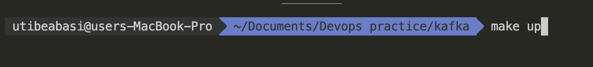
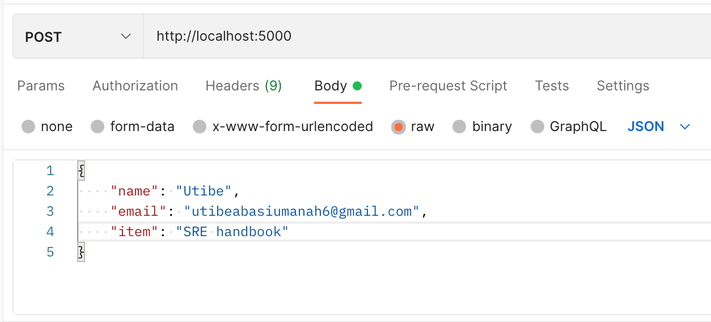
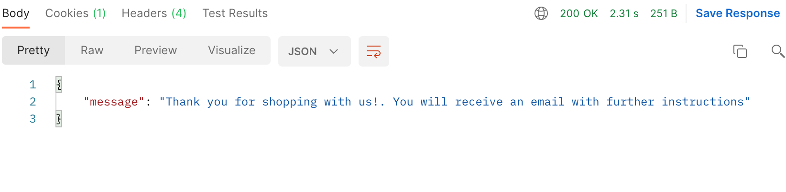
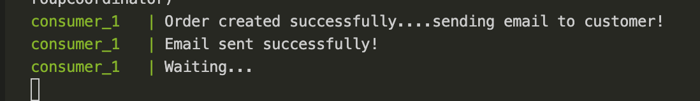
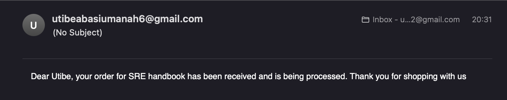

# Kafka microservice

An order microservice built with python that uses Kafka as a message broker

## Prerequisites

To follow up with this guide, make sure you have the following installed

- [Docker](https://docs.docker.com/get-docker/)

- [Docker Compose](https://docs.docker.com/compose/install/)

## How to run

- Clone the repo by running `git clone <repo_url>`

- In the docker-compose.yaml file, update the values of `GMAIL_USER` and `GMAIL_PASSWORD` to match that of your email client. If you are using gmail, make sure to have less secure apps enabled

- A Makefile has been provided for easy setup so `cd` into the `kafka-microservice` directory and run the command `make up` to startup docker compose. This command builds the required containers and starts them up. The process might take a while so be patient. You should see logs from the `consumer_1` container when the setup is complete

- Now, make a `POST` request to `http://localhost:5000` as seen below

- If all goes well, you should see the following output

- And the email recipient should get an email that looks like this

- Finally, kill the running processes with `ctrl+c` and run `make down` to remove the containers created.
